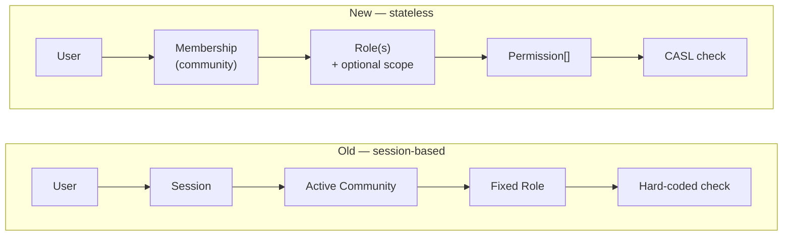
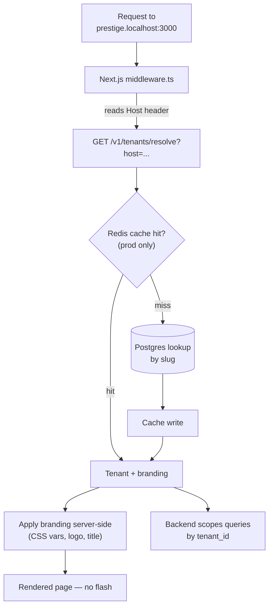
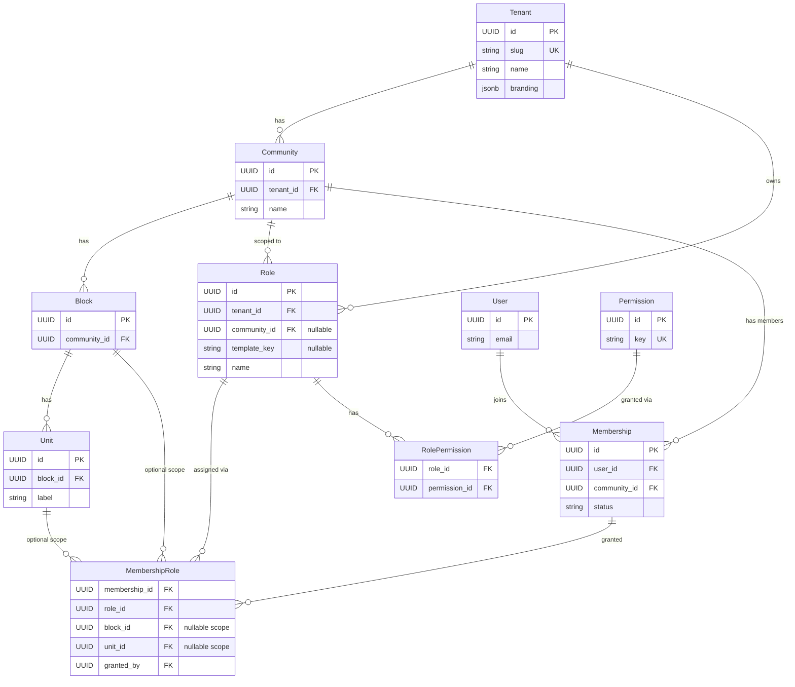
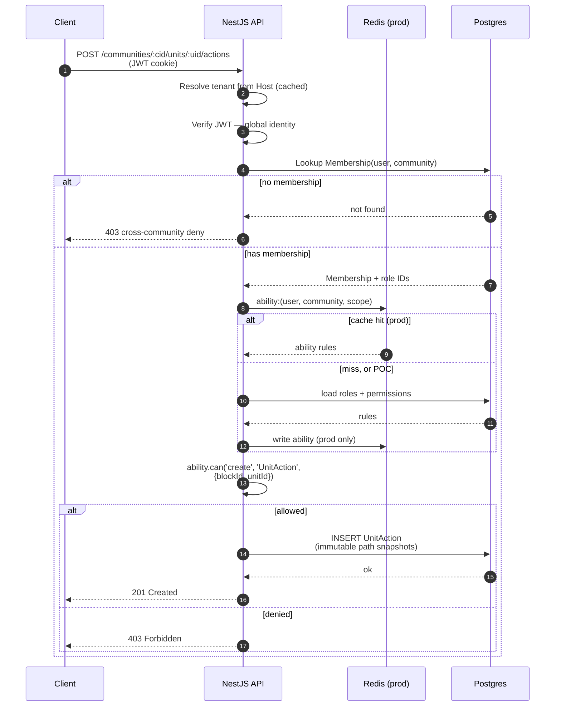

# Tenant-Aware Multi-Community RBAC Re-Architecture

## Overview

This document specifies a re-architecture of the existing residential-community
SaaS from a session-based, single-active-community, fixed-role system into a
multi-tenant platform with stateless APIs, dynamic RBAC, and per-tenant
white-labeling.

The existing business hierarchy is preserved:

```text
Community → Block → Unit → User
```

Actions are recorded at unit level. What changes is **how identity,
authorization, and tenancy are modeled** around that hierarchy.

The POC ships with two tenants × two communities each (Prestige and Sobha),
demonstrating tenant-boundary isolation, multi-community management, dynamic
roles, and subdomain-based white-labeling end-to-end.

---

## 1. Problems in the current system

| # | Limitation | Why it hurts users |
|---|---|---|
| 1 | Session-based community switching | A manager of 5 communities must toggle context constantly; multi-tab and deep links are broken. |
| 2 | Single active community per session | URL has no notion of community, so bookmarks, shared links, and API clients all break. |
| 3 | Fixed, hard-coded roles | A new role (Night Security, Election Committee, Pet Committee) needs a code change and deployment. |
| 4 | Tight coupling between session and authz | Authorization depends on hidden server-side state; hard to test, hard to scale horizontally. |
| 5 | No tenant boundary | Customer organizations (Prestige, Sobha) are not first-class; branding lives at the community level, fragmenting the customer's identity. |
| 6 | No real multi-community management | A user with units in two communities, or managing five, has to log in and out. |

---

## 2. Re-architected model

```text
Platform
 └── Tenants                ← customer org, owns N communities, hosts branding
      └── Communities       ← URL-scoped, stateless
           └── Blocks
                └── Units   ← actions recorded here

Users (global identity)
  └── Memberships (per community)
        └── MembershipRoles (with optional block/unit scope)
              └── Roles (instantiated from system templates, editable per community)
                    └── Permissions
```

Three architectural shifts:

1. **Tenant becomes the top of the business hierarchy.** Branding, domain, and
   eventually billing live on the tenant — consistent across all of that
   customer's communities.
2. **Users are global identities.** A user can belong to many communities (in
   one or many tenants). The session does not carry "current community"; the
   URL does.
3. **Authorization is stateless and permission-based.** The JWT carries
   identity only. For each request, the system resolves the user's ability for
   the `(user, community, scope)` triple and checks `ability.can(action,
   subject)`.

### Old vs new



---

## 3. Tenant layer and white-labeling

### Tenant entity

```text
Tenant
- id          UUID, PK
- name        text
- slug        text, UNIQUE         (drives subdomain: prestige.anacity.com)
- branding    jsonb                (logo, primaryColor, theme)
- settings    jsonb                (feature flags, future billing slot)
- created_at  timestamptz
- updated_at  timestamptz
```

`slug` is unique because the domain → tenant resolver depends on it for
correctness.

### Domain → tenant resolution



Two layers run the same resolver and share the same cache key:

| Layer | Purpose |
|---|---|
| Next.js `middleware.ts` | Resolve tenant for page rendering and branding. |
| NestJS tenant middleware | Resolve tenant for API requests and attach to `req.tenant`. |

In local dev, `*.localhost` resolves automatically in browsers, so
`prestige.localhost:3000` and `sobha.localhost:3000` work without any DNS or
hosts-file changes.

### Branding response

```json
{
  "tenant": "Prestige",
  "slug": "prestige",
  "branding": {
    "logo": "/cdn/prestige-logo.svg",
    "primaryColor": "#0047AB",
    "theme": "default"
  }
}
```

Open two tabs to two subdomains, see two different brands rendered server-side.
That is the visible POC payoff for white-labeling.

### Out of scope for the POC (see §8)

Vanity apex domains (`prestige.com`), Let's Encrypt / Caddy on-demand TLS,
DB-layer tenant isolation via Postgres RLS. All called out in §8 as production
hardening.

---

## 4. Dynamic RBAC — the core of this redesign

### Entities

```text
Permission
- id     UUID, PK
- key    text, UNIQUE       (e.g. 'approve_visitor', 'create_notice')

Role
- id           UUID, PK
- tenant_id    UUID, FK Tenant         (roles are per tenant)
- community_id UUID, FK Community, NULLABLE   (NULL = tenant-wide template-instance)
- template_key text, NULLABLE          (links back to system template if instantiated)
- name         text
- description  text
- created_at   timestamptz
- updated_at   timestamptz
- deleted_at   timestamptz, NULLABLE   (soft-delete)
- UNIQUE (community_id, name) WHERE deleted_at IS NULL

RolePermission
- role_id        UUID, FK Role
- permission_id  UUID, FK Permission
- PRIMARY KEY (role_id, permission_id)

Membership
- id            UUID, PK
- user_id       UUID, FK User
- community_id  UUID, FK Community
- status        text   (active | invited | suspended)
- created_at    timestamptz
- updated_at    timestamptz
- UNIQUE (user_id, community_id) WHERE status != 'removed'

MembershipRole
- membership_id  UUID, FK Membership
- role_id        UUID, FK Role
- block_id       UUID, FK Block,  NULLABLE   ← optional scope
- unit_id        UUID, FK Unit,   NULLABLE   ← optional scope
- granted_by     UUID, FK User
- granted_at     timestamptz
```

### Entity-relationship diagram



Three things this diagram makes load-bearing:

1. **Users are not under units.** They are global identities linked to
   communities via `Membership`.
2. **Permissions are global keys; Roles are containers; the grant is a
   `MembershipRole`** — that's where authz actually lives.
3. **Scope (block/unit) is on the grant, not the role.** The same role can be
   granted community-wide to one user and block-scoped to another.

### System role templates (one-tier instantiation)

```text
SystemRoleTemplate
- key          text, UNIQUE   ('resident', 'admin', 'security', ...)
- name         text
- permissions  text[]         (permission keys)
```

Shipped with the platform. When a community is created, the standard roles
(Admin, Resident, Security, Manager) are **instantiated** as community-scoped
`Role` rows from these templates. Each community can then edit those roles or
add custom ones — the template was a starting point, not an enforcement layer.

This is the simplest model that still solves the "don't hand-rebuild the same
six roles per community" problem without inventing extra tiers.

### Permission examples

```text
approve_visitor
view_visitors
create_notice
view_notices
manage_maintenance
raise_maintenance
view_finance
assign_roles
manage_units
create_unit_action
```

### Dynamic custom role example

A community admin can create, via the UI, with no deployment:

```text
Name:        Night Shift Security
Permissions: [approve_visitor, view_visitors]
Scope:       Block 3 only
Assigned to: ravi
```

After the admin clicks save, `ravi` can approve visitors for Block 3 units on
his very next request — and only Block 3.

---

## 5. Authorization flow per request

```http
POST /communities/:communityId/units/:unitId/actions
```



Code shape:

```ts
if (!ability.can('create', 'UnitAction', { blockId, unitId })) {
  return 403;
}
```

### Why the cache matters

Without a cache, every request runs 4–5 DB queries just to resolve the ability.
With Redis, the hot path is a single key lookup. **Invalidation is explicit,
not TTL-based** — every RBAC mutation (role CRUD, role-permission change,
membership-role change) busts the affected cache keys, so a revoked guard
loses access on the very next request, not when their token expires.

### Why permission-based, not role-based

```ts
// BAD — couples logic to a fixed role name
if (user.role === 'admin') { ... }

// GOOD — works with any dynamically-created role that has the permission
if (ability.can('approve_visitor', subject)) { ... }
```

This is what makes dynamic roles actually useful: business logic checks
permissions, not role names, so a brand-new role with the right permissions
"just works" without any code change.

---

## 6. Action recording

Actions remain unit-scoped, exactly as today.

```text
UnitAction
- id             UUID, PK
- tenant_id      UUID                (snapshot)
- community_id   UUID                (snapshot)
- block_id       UUID                (snapshot)
- unit_id        UUID                (snapshot)
- actor_user_id  UUID                (snapshot)
- action_type    text                ('visitor_approved', 'maintenance_raised', ...)
- metadata       jsonb
- created_at     timestamptz
- INDEX (community_id, created_at DESC)
- INDEX (unit_id, created_at DESC)
```

**Append-only.** No UPDATE path. Path columns are immutable snapshots so the
audit row survives renames or moves. Service-layer validation rejects any
write where `block ∉ community` or `community ∉ tenant`.

Examples: `visitor_approved`, `maintenance_raised`, `parking_assigned`,
`notice_created`, `payment_recorded`.

---

## 7. RBAC audit log

Every RBAC mutation is recorded — this is the answer to "who granted whom
which permission, and when?" — the first question after any privilege incident.

```text
RbacAuditLog
- id             UUID, PK
- tenant_id      UUID
- actor_user_id  UUID
- entity         text   (Role | RolePermission | MembershipRole)
- entity_id      UUID
- action         text   (create | update | delete)
- before         jsonb  (NULL on create)
- after          jsonb  (NULL on delete)
- created_at     timestamptz
- INDEX (tenant_id, created_at DESC)
```

A single NestJS interceptor wraps the RBAC service, so every mutation writes
an audit row without per-call boilerplate.

---

## 8. Migration from the session-based system

The existing system is live. Cutover is not big-bang.

```text
Phase 1   Add new tables alongside old (no behavior change)
Phase 2   Backfill: one tenant per existing customer; memberships from existing
          user→community links; roles instantiated from system templates
Phase 3   Dual-write: writes go to both old and new structures; reads still old
Phase 4   Per-tenant cutover behind a feature flag; one tenant at a time
Phase 5   Decommission old tables after a stable bake period
```

Every phase has a per-tenant rollback. Backfills are idempotent.

### Mandatory regression tests before any tenant cuts over

1. Existing users can still log in after their tenant flips.
2. Each old fixed role maps to a dynamic role with **identical** effective
   permissions (assert permission-set equality, not name).
3. Existing user → unit associations become `Membership` rows with no data
   loss.

A failing regression test blocks the cutover for that tenant. Never bypassed.

---

## 9. POC scope and seed

The POC ships two tenants × two communities each, hosted on subdomains:

```text
Tenant: Prestige   (slug: prestige  → prestige.localhost:3000)
  ├── Prestige Lakeside Habitat    (3 blocks, ~12 units)
  └── Prestige Falcon City         (2 blocks,  ~8 units)

Tenant: Sobha      (slug: sobha     → sobha.localhost:3000)
  ├── Sobha Dream Acres            (2 blocks,  ~8 units)
  └── Sobha Forest View            (2 blocks,  ~8 units)

Users (global identities):
  alice    admin @ Lakeside, resident @ Falcon         (multi-community, same tenant)
  bob      admin @ both Sobha communities              (multi-community, same tenant)
  carol    resident @ Lakeside AND @ Dream Acres       (cross-tenant identity)
  dave     resident @ Falcon — gets a custom role mid-demo
  ravi     security across all Prestige communities
```

### Demo flow (what you will see)

1. Visit `prestige.localhost:3000` → Prestige branding (blue, Prestige logo).
2. Log in as `alice` → her dashboard shows **both Prestige communities side
   by side**, no "switch community" anywhere.
3. Click into Lakeside → drill to a unit → record a `visitor_approved`
   action. URL is `/communities/lakeside/units/4B/actions` — stateless.
4. Open a second tab to `sobha.localhost:3000` → Sobha branding (different
   color, different logo). Log in as `bob` → different community list. No
   data from Prestige is visible.
5. Log in as `carol` on each subdomain → on Prestige she sees Lakeside only;
   on Sobha she sees Dream Acres only. Same user, different visible scope per
   tenant.
6. As `alice` (admin), open the Roles UI → create a new role
   `Night Shift Security` with permissions `[approve_visitor, view_visitors]`
   scoped to Block 3 → assign to `dave`.
7. Log in as `dave` → he can now approve visitors for Block 3 units, and only
   Block 3.
8. As `alice`, remove the role from `dave` → on his next request, the action
   is denied (Redis-cached ability invalidated on mutation).

Every load-bearing claim — multi-community without switching, stateless URLs,
white-labeling, dynamic roles, scoped grants, instant revocation — is visible
in this flow.

---

## 10. Production hardening (out of scope for POC)

Called out so it's clear these are known and deferred, not missed.

| Concern | Production approach | Why deferred for POC |
|---|---|---|
| **DB-layer tenant isolation** | Postgres Row-Level Security with `app.tenant_id` set per connection by Prisma middleware. Defense in depth — a forgotten app-level filter cannot leak data across tenants. | App-level `where tenant_id = ?` is sufficient to demonstrate the boundary. RLS is operational rigor on top. |
| **Vanity apex domains** (`prestige.com`) | Caddy on-demand TLS with Let's Encrypt; `ask` endpoint gates which hostnames trigger ACME so random domains can't exhaust rate limit; `Tenant.custom_domain_status` tracks lifecycle. | Subdomains under a wildcard cert demonstrate white-labeling fully. ACME provisioning is deployment work, not architecture. |
| **Ability cache** | Redis with explicit invalidation on every RBAC mutation. Cache key: `(user, community, scope)`. | POC resolves per request from DB; the invalidation contract is the only thing that matters at the architecture level, and it's described in §5. |
| **Audit table scaling** | Range-partition `UnitAction` monthly via `pg_partman`; archive old partitions; per-tenant retention. | A single indexed table is fine for POC volume. |
| **Temporal occupancy** | `UnitOccupant` table with `occupant_type` (owner / tenant / family), `is_primary`, `start_date`, `end_date` — supports ownership transfer and "who lived in 4B in 2023". | Brief models a simple user→unit link; temporal occupancy is real-world but additive. |
| **Token blast radius** | Short access-token TTL + refresh-token rotation; optional device binding. | Standard JWT for POC. |
| **Sharding** | RLS design preserves a clean upgrade path: logical sharding by `tenant_id` (Citus or app-level) with no data-model rewrite. | Not needed at POC scale; design does not preclude it. |

---

## 11. Tech stack

**Backend.** Node.js · TypeScript · NestJS · PostgreSQL · Prisma ORM ·
CASL (Prisma-integrated authorization) · Redis (optional in POC, production
required for ability + domain caches).

**Frontend.** Next.js (App Router) with React Server Components ·
TailwindCSS. Edge middleware (`middleware.ts`) handles domain → tenant
resolution server-side so branding renders without flash. NestJS is the API;
Next.js API routes are used only for BFF concerns (auth cookie bridging).

**Test.** Jest + Supertest for backend integration; Playwright for the five
E2E flows described in §9.

---

## 12. Test strategy

Authorization is the highest-value test surface. A green happy-path with a
broken isolation test is a customer data leak.

### Mandatory isolation matrix

| # | Scenario | Expected |
|---|---|---|
| 1 | Token from tenant A, request for tenant B's community | 403 / 404 |
| 2 | User in community C1, request for community C2 (same tenant) | 403 |
| 3 | Community admin attempts to grant a platform-elevated permission | denied |
| 4 | Revoke a role → next request from that user | denied (cache busted) |
| 5 | Block-3-scoped grant attempts action on a Block-4 unit | denied |
| 6 | `UnitAction` write with `block_id ∉ community_id` | rejected |
| 7 | Same user logged into both tenants sees only the correct communities per host | enforced |

### Mandatory migration regressions

The three regressions in §8 must pass before any tenant cuts over.

### E2E flows (Playwright)

1. Login on tenant subdomain → see only my communities for that tenant.
2. Multi-community user takes actions on two communities in two tabs in
   parallel — no session collision.
3. Admin creates a dynamic role, assigns it, user gains the new capability
   without re-login.
4. Admin revokes the role, user loses access on next request.
5. Tenant-A user cannot read tenant-B data via direct URL.

---

## 13. Engineering principles

1. **Stateless authorization.** Identity in the token, context in the URL,
   ability resolved per request and cached. No "current community" lives on
   the server.
2. **Permission-based checks, not role-name checks.** `ability.can(...)`,
   never `if (role === 'admin')`. This is what makes dynamic roles useful.
3. **Tenant is the white-label boundary.** Branding lives on the tenant so a
   customer's identity is consistent across their communities.
4. **Audit by default.** Every RBAC mutation writes a `RbacAuditLog` row;
   every unit action writes a snapshot row that survives renames and moves.
5. **Reversibility.** Migrations are flagged per tenant; soft-delete preserves
   history for roles and memberships; cache invalidation is explicit on
   mutation, not TTL-only.

---

## Final statement

> The redesign moves the system from session-based, single-active-community,
> fixed-role authorization to a stateless, multi-tenant model where users are
> global identities, roles and permissions are database rows editable from the
> UI, and authorization is a per-request CASL check against a cached ability
> set. The tenant layer makes white-labeling a first-class concern; the
> migration plan makes the cutover non-disruptive. Production hardening
> (RLS, vanity domains, partitioning) sits on top of this design without
> changing it.
